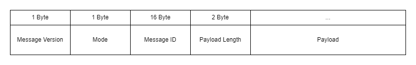

# Cryptography Utility Service in Go
This is a simple crypto service written in Go. The purpose is to have central cryptography control for the whole system. 

This service provides encryption, decryption and hashing control.

# Environment
Three environment variables are required in the current version for this service to work.
|Name|Description|
|-|-|
|aes_key|Key for AES encryption/decryption. Service reads it from the system's environment variable|
|tls_key|TLS key file full path.|
|tls_cert|TLS certificates full path|

# Network Interface
This service is TCPIP-based.  The core service code is in **main.go** file. 

# Packet Fields Breakdown
|Field Name|Length|Description|
|-|-|-|
|Message Version|1 Byte|contain the version of package.|
|Mode*|1 Byte|Instruction for service with what to do with the packet.|
|Message ID*|16 Byte|Human read message ID. Mainly for logging and tracking messages |
|Payload Length*|2 Byte|Specifies the length of payload. |
|Payload|**[variable]**|Contain the data to be processed by the service according to the mode specified. This is treated as a byte array of Hex.|

**Mode** = The most significant bit of the byte is reserved to donate a response from the service. The rest of the 7-bit will be echoed back as is.

**Message ID** = Preferably human-readable ASCII string.

**Payload Length** = This implementation's Max limit is 8K Bytes. It can be changed using the variable **BUFFER_LENGTH** in **config.go**

# Mode Specification
|Mode Value|Response|Description|
|-|-|-|
|0x00|0x80|Encypt data with AES |
|0x01|0x81|Decrypt data with AES |
|0x02|0x82|Hash passwords with bcrypt |
|0x03|0x83|Validate hashes against a password string |