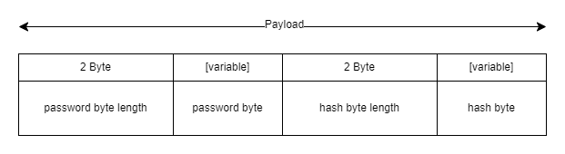
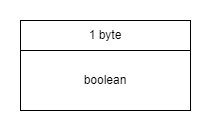

# bcrypt
A centralized bcrypt hashing. 

# Payload Structure
Hashing has different semantic needs. To cater these, seperate payload structure was needed for bcrypt.  

## Hash Password `0x02`
Mode `0x02`(Hash password string) messages has one block of data in their payload. `0x02` has password bytes in it and its corresponding response `0x82` has hashed bytes.

## Hash and Password Compare `0x03`
Comparison message between hash and password strings has two component in its packet. Both of these component are sent in payload field. Structure of corresponding payload is shown in figure below.

Response for comparison is a boolean value of `1 byte`. `0x00` for `false` and `0x01` for `true`. Payload is just one byte.

